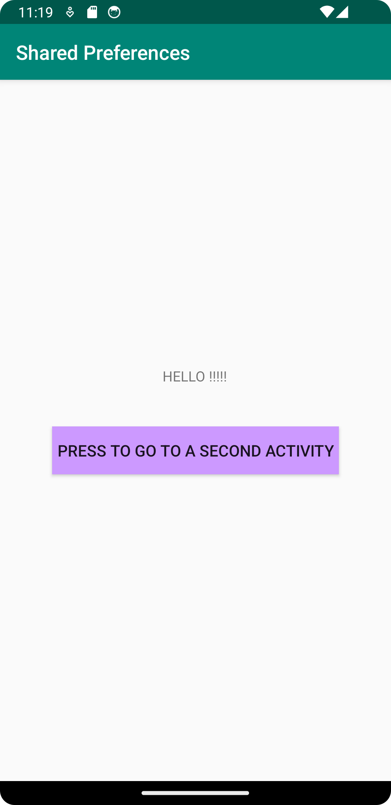
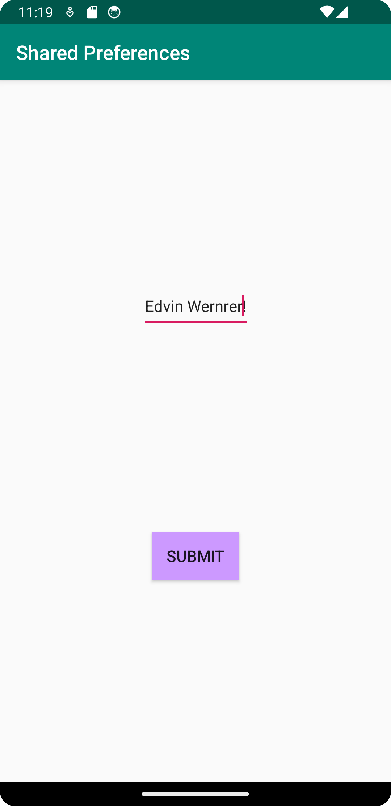

# Rapport
Jag har gjort det möjligt för en användare att spara en textstring mellan olika användingstillfällen.
koden som sparar textstringen finns i activity 2 och ser ut så här:
```
    void store() {
        EditText sharedPrefData = findViewById(R.id.my_edittext);
        myPreferenceEditor.putString("key", sharedPrefData.getText().toString());
        myPreferenceEditor.apply();
    }
}
```
Denna metod kallas sedan på varje gång en användare trycker på knappen "submit".
```
           Submit.setOnClickListener(new View.OnClickListener() {
            @Override
            public void onClick(View view) {
                store();
                Intent intent = new Intent(Activty2.this, MainActivity.class);
                startActivity(intent);
            }
        });
```

